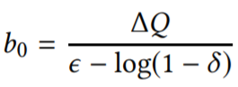
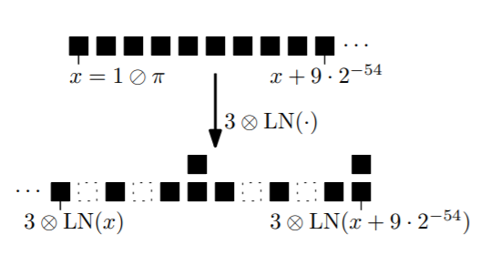
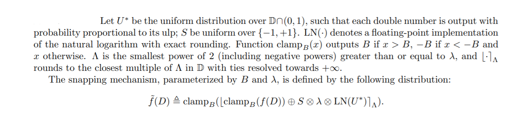

# Design Documentation

#### Mitigate Laplace Noise Overflow before calculating the result

First, a note on how Laplace Noise is implemented in Google's DP C++ Library: You can generate samples from the Laplace distribution using the Ratio of Uniforms method (for more information see [here](<http://www.nrbook.com/devroye/Devroye_files/chapter_four.pdf>), p. 195), which is "cleaner and more accurate than the typical Inverse CDF method under fixed precision arithmetic" ([source]( https://github.com/google/differential-privacy/blob/master/differential_privacy/algorithms/distributions.cc )). As background, see [this Stack Overflow post](<https://math.stackexchange.com/questions/595900/laplace-distribution-from-uniform-distrubtion>) for the theory on why log X/Y ~ Laplace(0, 1), where X and Y are Uniform Distributions.

**Current Implementation:** Check the overflow probability using the following formula (implementation sourced from [Google&#39;s DP Library C++ numerical-mechanisms.h]( https://github.com/google/differential-privacy/blob/master/differential_privacy/algorithms/numerical-mechanisms.h ):

```
let _kMaxOverflowProbability = Math.pow(2.0, -64);
let diversity = l1_sensitivity / epsilon;
let overflow_probability = (1 - this.cdf(diversity, Number.MAX_VALUE)) + this.cdf(diversity, Number.MIN_VALUE);
if (overflow_probability >= this._kMaxOverflowProbability) {
      StatusCode.NoiseOverflow;
    }
```

##### Options for implementing a bounded Laplacian mechanism **that we should consider**: 

Negative outputs from the Laplacian mechanism are possible and these values can be illogical and inconsistent. "By the symmetry of the Laplace distribution, on average 50% of the outputs will be negative."

**Two solutions for this are:**

- **Truncation (Not implemented yet in TypeScript):** project values outside the domain to the closest value within the domain (e.g. if the Laplace mechanism returns a value −1.71, the truncation method projects
  the output to 0, which is the lower bound of a count query).

  *Disadvantage:* "By design, the truncated Laplace mechanism has a (possibly large) non-zero probability of returning values at the domain bounds. There are instances where this may be undesirable and/or incompatible, such as when the domain bounds coincide with singularities or values that otherwise result in a qualitative change in behaviour (e.g. bifurcation points)."

  **Note: **Google's DP Java library generates Laplacian noise using a geometric random sample - they state the approach is robust against unintentional privacy leaks due to floating point arithmetic artifacts. See their [implementation](https://github.com/google/differential-privacy/blob/master/java/main/com/google/privacy/differentialprivacy/LaplaceNoise.java>) for more details.

- **Bounding (Not implemented yet in TypeScript)**: Continue to sample independently from the mechanism until a value within the domain is returned. Bounding the Laplace mechanism is useful in cases such as "releasing the variance of a
  distribution while using the Laplace mechanism to achieve differential privacy. Zero variance is qualitatively different to non-zero variance, and may result in complications in its use. In this case
  the bounded mechanism is a more appropriate choice as it has a zero probability of returning a zero variance."

  *Disadvantage:* The bounded Laplace mechanism does not typically satisfy differential privacy when inheriting parameters from the pure Laplace mechanism. 

  The authors proposed the following steps to solve this issue:

  - Find the optimal value for b - **non-trivial**
  - Determine the value of ϵ (or a relationship between ϵ and δ) to a given value of b. - **trivial**

  

  For the first point on "finding the optimal value for b": The variance of the Laplace distribution must be increased for the bounded Laplace mechanism to satisfy the same differential privacy constraints. The authors show the noise added to achieve differential privacy must be of greater variance than that of the pure Laplace mechanism, where the variance required for the pure Laplace mechanism is defined as 

TODO: Looking into the implementation of [LaplaceBoundedNoise and LaplaceBoundedDomain in IBM's DP Library](<https://github.com/IBM/differential-privacy-library/blob/master/diffprivlib/mechanisms/laplace.py>) to see if the insights can be applied here.

#### Ensure numerical stability after adding noise

The content for this section is reused and modified from ["On Significance of the Least Significant Bits For Differential Privacy"](<http://citeseerx.ist.psu.edu/viewdoc/download?doi=10.1.1.366.5957&rep=rep1&type=pdf>) by Ilya Mironov.

**Motivation:**

Standard floating-point Laplacian sampling procedures result in very porous distributions, missing out on many possible output values. 

Below, we see an example of applying the log function (from C++'s math.h function) to a set of 10 double numbers follows 1/pi and then multiply the result by 3 (corresponding to sampling from the Laplacian mechanism with ∆ = 1 and ϵ = 1/3:)



We can observe from the above diagram two issues: The approximation of the Laplace distribution has 1) some potential output values have become missing (the empty squares) and 2) values appearing more frequently than they should (the stacked squares).

**A practical attack:**

The following attack can be used to reconstruct an entire database by issuing adaptively-chosen queries using an arbitrarily small total privacy budget:

- We have a database with a list of alphanumerical records and a query language that reports counts of records sharing a particular prefix. 
- We begin by obtaining an upper bound on number of records in the database
- We then ask a histogram query on the first character of all records - we ask the number of records that start with ‘\0’, ‘\1’,. . . ,‘\255’. Initially, all counts up to the upper bound are feasible, but with every query, approximately 40% of the counts not equal to the exact answer can be excluded.
- After a unique count for each first character is identified, we append all possible characters to prefixes
  with non-zero support, and iterate the process until the entire dataset is recovered.

##### Snapping mechanism (current implementation)

The snapping mechanism can be succinctly and informally defined as based on rounding after the addition of noise ([source](<https://hiplab.mc.vanderbilt.edu/courses/BMIF380/Lectures/non-interactive-dp-web.pdf>)). The formal definition, taken from the paper ["On Significance of the Least Significant Bits For Differential Privacy"](<http://citeseerx.ist.psu.edu/viewdoc/download?doi=10.1.1.366.5957&rep=rep1&type=pdf>), is shown below:



Google's DP library currently implements this in C++ using the following code - **we reuse this implementation for Typescript**:

```typescript
  // Returns the smallest power of 2 greater than or equal to n. n must be > 0.
  // Includes negative powers.
  private getnextpoweroftwo = (value: number): number => {
    return Math.pow(2.0, Math.ceil(Math.log2(value)));
  }

  // Rounds n to the nearest multiple of base. Ties are broken towards +inf.
  // If base is 0, returns n.  
  private roundtonearestmultiple = (n: number, base: number): number => {
    if (base == 0.0) return n;
    let remainder = n % base;
    if (Math.abs(remainder) > base / 2) {
      return n - remainder + Math.sign(remainder) * base;
    }
    if (Math.abs(remainder) == base / 2) {
      return n + base / 2;
    }
    return n - remainder;
  }
  let initial_result = this.Clamp(this.getLowerBounds(), this.getUpperBounds(), queryResult) + noise;
  let nearest_power = this.getnextpoweroftwo(diversity / this._privacy_budget);
  let rounded_result = this.roundtonearestmultiple(initial_result, nearest_power);
  let final_noised_result = this.Clamp(this.getLowerBounds(), this.getUpperBounds(), rounded_result);
```

Here, as described in the formal definition provided above, roundtonearestmultiple() rounds n to the closest multiple of the base with ties broken towards +inf. If the base is 0, n is returned.

Mironov notes that since the clamp is a stable transformation, applying it *before* feeding the result into a differentially private mechanism or post-processing the output of the mechanism through snapping and clamping preserves the mechanism’s privacy guarantees. Furthermore, the author notes that: "Since the mechanism “snaps” the output of a floating-point computation to the nearest multiple of Λ, the error it introduces relative to the underlying Laplacian mechanisms is at most Λ/2 < λ. Before the outer clamping is applied, the mechanism is unbiased. Depending on the relative magnitude of the range of f(·), λ and B, the bias introduced by clamping may be exceedingly small."

#### Bounding input data

**(Not implemented in TypeScript)**

Depending on the query, certain queries require lower and upper input bounds as parameters - for example, Sum or Mean queries can potentially be bounded.

Google's DP C++ Library supports two ways to set lower and upper bounds:

- Manually.

- Automatically infer the bounds, which uses up the privacy budget (e.g. using a fraction of the privacy budget to find the approximate bounds). Google's library implements this using functionality, called ApproxBounds, that can find the approximate bounds of a set of numbers using logarithmic histogram bins. The details related to what parameters are input to ApproxBounds can be found at the documentation here: [ApproxBounds](<https://github.com/google/differential-privacy/blob/master/differential_privacy/docs/cpp_lib/algorithms/approx-bounds.md>), [BoundedAlgorithm](<https://github.com/google/differential-privacy/blob/master/differential_privacy/docs/cpp_lib/algorithms/bounded-algorithm.md>), [BoundedSum](<https://github.com/google/differential-privacy/blob/master/differential_privacy/docs/cpp_lib/algorithms/bounded-sum.md>) (other examples of bounded algorithms such as BoundedMean and Bounded Variance are present [in the docs/ folder in their repository](<https://github.com/google/differential-privacy/blob/master/differential_privacy/docs/cpp_lib/algorithms/bounded-sum.md>)). 

  An example of how ApproxBounds works is as follows, taken from the [implementation of ApproxBounds](<https://github.com/google/differential-privacy/blob/master/differential_privacy/algorithms/approx-bounds.h>):

  ```typescript
  // For example, if
  //   scale = 2, base = 1, num_bins = 4, inputs = {0, 0, 0, 0, 1, 3, 7, 8, 8, 8}
  // We have histogram bins and counts
  //   [0, 1]: 5
  //   (1, 2]: 0
  //   (2, 4]: 1
  //   (4, 8]: 4
  // Then if success_probability=.9 and epsilon=1 we will obtain approximately
  // threshold=3.5. Since the count of bin (4, 8] > threshold we return an
  // approx max of 2^3 = 8. Since the count of bin [0,1] > threshold we return an
  // approx min of 0.
  ```

  

### Privacy Budget

Actions that use up the privacy budget:


- Extracting a result from an algorithm
- Automatically inferring input bounds
- ...